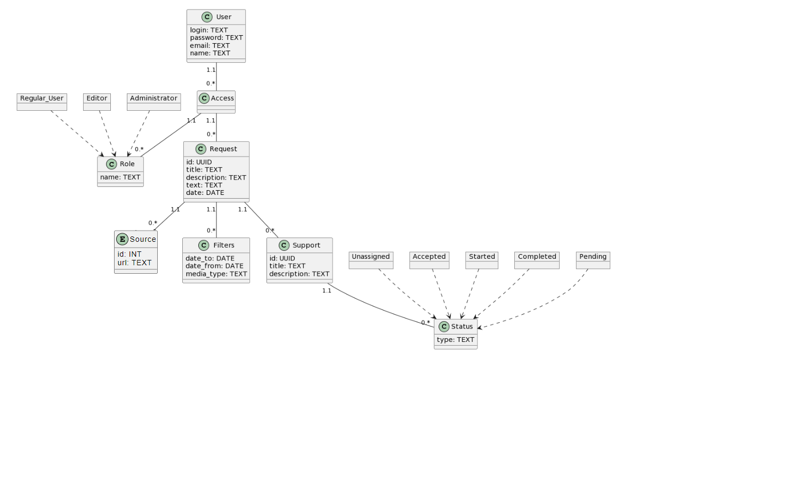

# Проєктування бази даних

В рамках проекту розробляється: 
## модель бізнес-об'єктів 
@startuml
() "User" as U
() "User.login" as U1
() "User.password" as U2
() "User.email" as U3
() "User.name" as U4
() "Access" as A

() "Role" as Rr
() "User" as Rr1
() "Editor" as Rr2
() "Administrator" as Rr3
() "Role.name" as Rr4

() "Request" as R
() "Request.id" as R1
() "Request.title" as R2
() "Request.date" as R3
() "Request.text" as R4
() "Request.description" as R5

() "Media" as M
() "Media.id" as M1
() "Media.name" as M2
() "Media.type" as M3
() "Media.url" as M4
() "Media.Metadata" as M5

() "Filters" as F
() "Filters.date_from" as F1
() "Filters.date_to" as F2
() "Filters.media_type" as F3

() "Support" as S
() "Support.id" as S1
() "Support.title" as S2
() "Support.description" as S3
() "Status" as St

() "Unassigned" as St1
() "Accepted" as St2
() "Started" as St3
() "Completed" as St4
() "Pending" as St5
() "Status.type" as St6

U1 --* U
U2 --* U
U3 --* U
U4 --* U

U "1.1" - " 0.* "A
Rr "1.1" -- "0.* " A

Rr1 --|> Rr
Rr2 --|> Rr
Rr3 --|> Rr
Rr4 --* Rr

R "1.1" -- "0.* "A
R1 ---* R
R2 ---* R
R3 ---* R
R4 ---* R
R5 ---* R

R "0.* " -- "1.1" F
F1 --* F
F2 --* F
F3 --* F

M "1.1" -- "    0.* "R
M1 --* M
M2 --* M
M3 --* M
M4 --* M
M5 --* M

R "0.* " --- "1.1" S
S1 --* S
S2 --* S
S3 --* S

S "0.* "---- "1.1"St
St <|-- St1
St <|-- St2
St <|-- St3
St <|-- St4
St <|-- St5
St6 --* St
@enduml 

## ER-модель
@startuml

class User {
login: TEXT
password: TEXT
email: TEXT
name: TEXT
}

class Access {
}

class Role {
name: TEXT
}

class Media {
id: UUID
name: TEXT
type: TEXT
url: url-reference
metadata: url-reference
}

class Request {
id: UUID
title: TEXT
description: TEXT
text: TEXT
date: DATE
}

class Filters {
date_to: DATE
date_from: DATE
media_type: TEXT
}

class Support {
id: UUID
title: TEXT
description: TEXT
}

class Status {
type: TEXT
}

object Regular_User
object Editor
object Administrator

object Unassigned
object Accepted
object Started
object Completed
object Pending

User "1.1" -- "0.* " Access
Access "1.1" -- "0.* " Role
Access "1.1" -- "0.* " Request
Request "1.1" -- "0.* " Media
Request "1.1" -- "0.* " Filters
Request "1.1" -- "0.* " Support
Support "1.1" -- "0.* " Status

Regular_User ..> Role
Editor ..> Role
Administrator ..> Role

Unassigned ..> Status
Accepted ..> Status
Started ..> Status
Completed ..> Status
Pending ..> Status

@enduml

##реляційна схема

