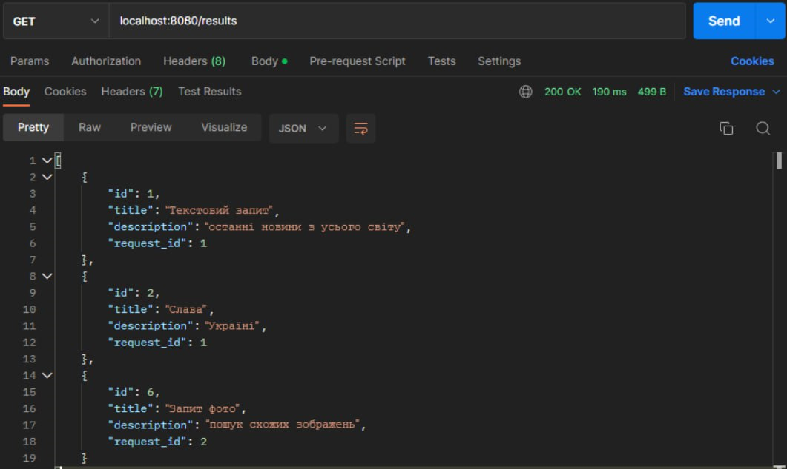
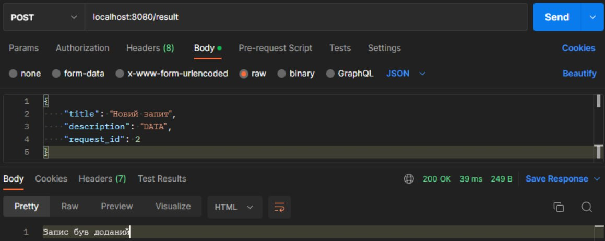
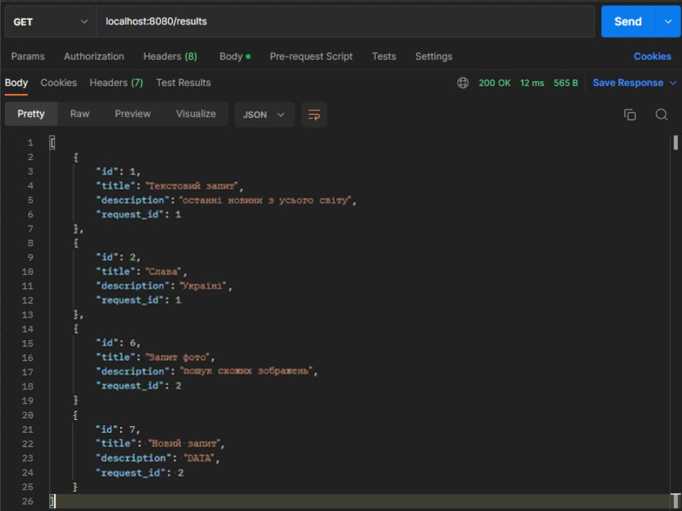
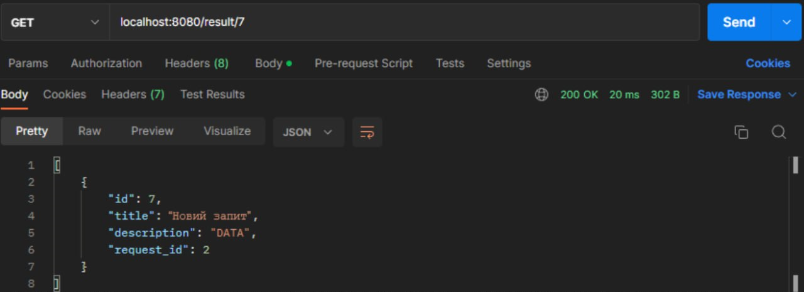
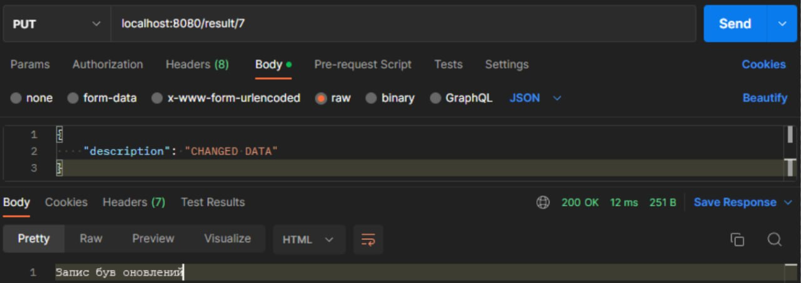
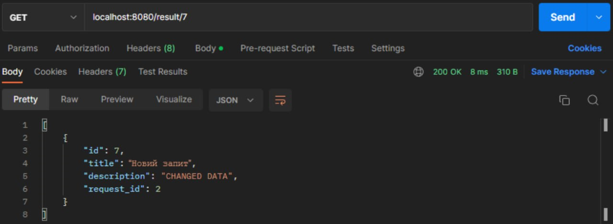
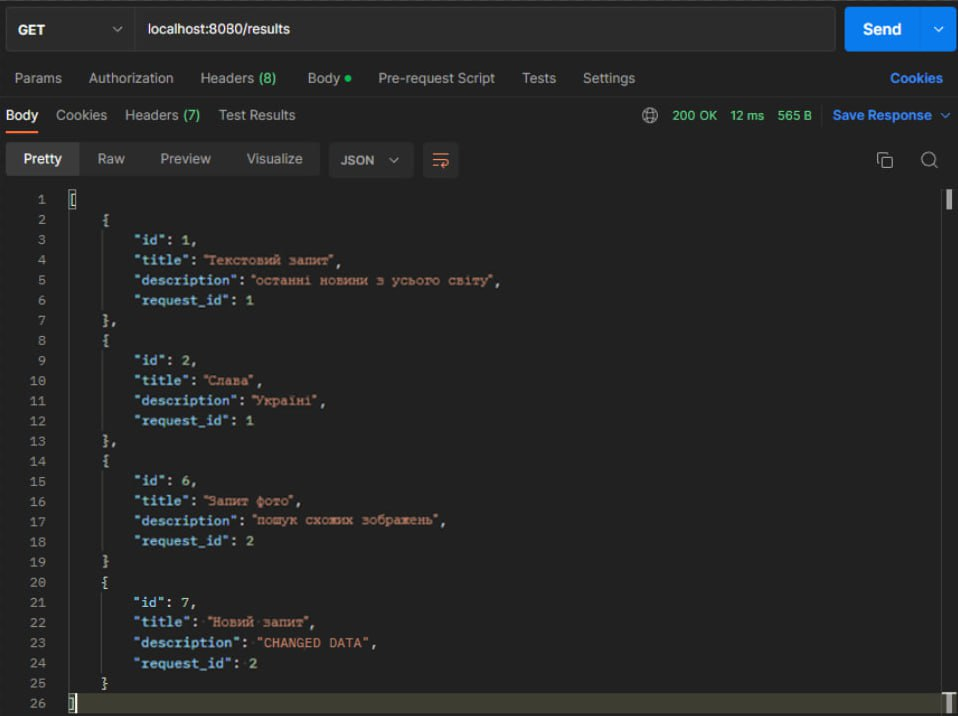
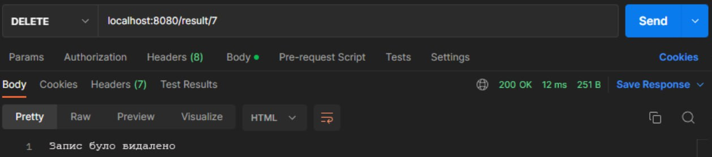

# Тестування працездатності системи

## Основні положення

#### Тестування відбувається через **Postman** - програмне забезпечення для роботи з API (у тому числі тестування).

## Тестування REST API

## POST - create
### Таблиця перед запитом

### Запит

### Таблиця після запиту

## GET - read

### Усі елементи

### Пошук за ID

## PUT - update

### Елемент перед запитом

### Запит

### Елемент після запиту

## DELETE

### Таблиця перед запитом

### Запит

### Таблиця після запиту
