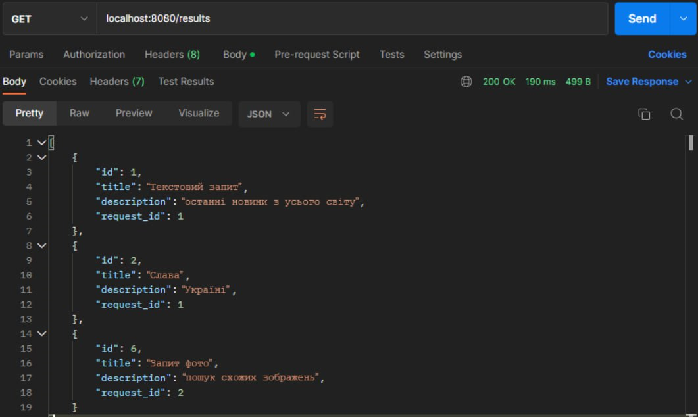

# Тестування працездатності системи

## Основні положення

Тестування відбувається через **Postman** - програмне забезпечення для роботи з API (у тому числі тестування).

## Тестування REST API

### POST - create
#### Таблиця перед запитом

#### Запит

#### Запит по ID

### GET - read

#### Усі елементи

#### Пошук за ID<!-- 

### PUT - update

#### Запит

### DELETE

#### Запит
